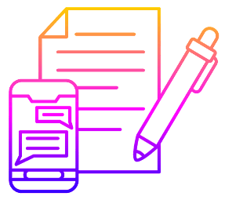
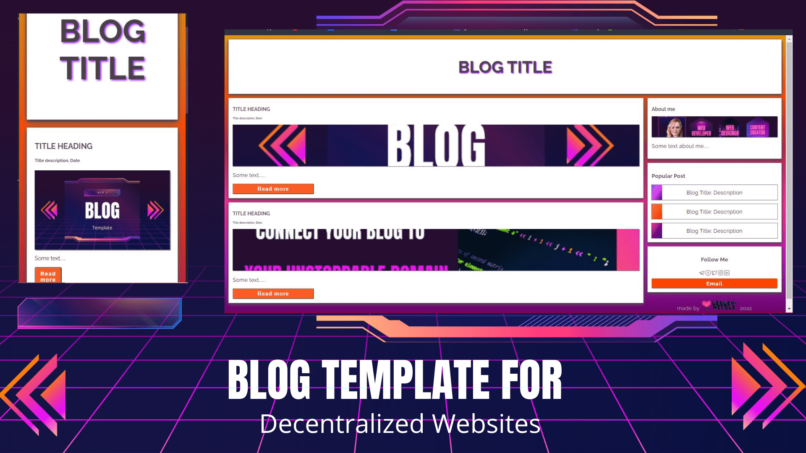

<p align="center"></p>

<h1 align="center">Blockchain Blog</h1>

<p align="center">
A colorful, responsive blog template for decentralized websites. Customize styles, add your details and links, then upload it to your <a href="https://unstoppabledomains.com">Unstoppable Domain.
</p>

---

<h2 align="center">Details</h2>

- Responsive 
- Two sections for two blog posts
- 'About Me' section
- 'Popular Posts' section to link 3 more posts
- Social Media section
- Email button for contact method
- footer for your logo

 

<h3 align="center">Installation</h3>

```
git clone https://www.github.com/lesley-nicole/d-blog

```

<p align="center">Open the folder in any <i>text editor</i> to customize it.</p>


<h3 align="center">Usage</h3>


1. Customize the template and add your information and links.

2. Go to your [Unstoppable Domains](https://unstoppabledomains.com) dashboard.

3. Go to **_My Domains_** section

4. Select **_Manage_** next to the domain you want to use.

5. Select the **_Website_** tab and upload your files to the IPFS Uploader and save.

>The method described above is the easiest. However there is a 20MB file limit, so if you exceed this, you will need to use a _pinning service_ such as **'Pinata'** or **'Temporal'** and upload manually.


##### Credits

- Image compression:  https://imageresizer.com/image-compressor

- Image Background Elements: https://www.canvas.com


##### Liscense

MIT 2022


---

<p align="center"><a href="https://lesley-nicole.github.io">
</a>
</p>


